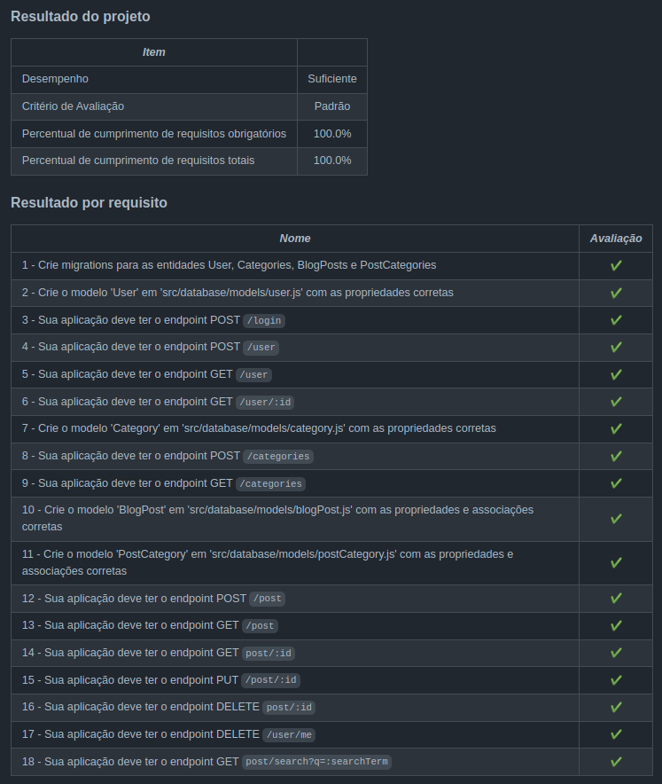

<h1>Sobre</h1>

Sexto projeto do módulo 3 - Back-end, da <a href="https://betrybe.com" target="_blank">Trybe!</a>

Dessa vez foi o projeto Blogs-API. O desafio foi construir um banco de dados e uma API (com arquitetura MSC) para produção de conteúdo de um blog.

 Para melhor visualização dos endpoints, utilize o endpoint '/doc', em que será possível ver a documentação feita por meio do swagger 

<h1>Instalando</h1>

Para instalar, basta executar o comando <code>npm install</code> no diretório raiz do projeto.

Logo depois, rode o comando <code>docker-compose up</code>, também, no diretório raiz do projeto. 

Por fim, execute o comando <code>npm start</code>

<h1>Tecnologias utilizadas</h1>

<ul>
  <li>Docker</li>
  <li>mySQL</li>
  <li>Node.js</li>
  <li>Express</li>
  <li>Joi</li>
  <li>Sequelize</li>
  <li>JWT</li>
  <li>Swagger</li>
</ul>

<h1>Aplicação</h1>

<h1>Nota</h1>

 